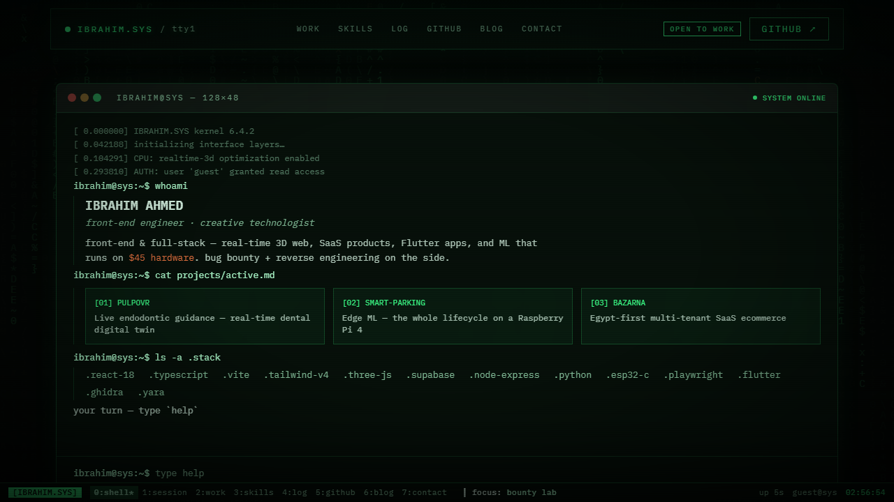

# IBRAHIM.SYS — a portfolio that is a terminal

[](https://github.com/Locked-Cloud/portfolio/actions/workflows/ci.yml)
[](https://github.com/Locked-Cloud/portfolio/actions/workflows/ci.yml)
[](scripts/check-size.js)
[](LICENSE)

**Live:** <https://locked-cloud.github.io/portfolio/> · **CV:** [/cv.html](https://locked-cloud.github.io/portfolio/cv.html) (bilingual, print-ready) · **Devlog RSS:** [/rss.xml](https://locked-cloud.github.io/portfolio/rss.xml)



The site boots a BIOS, answers as a shell, browses work as a file manager, and shows the visitor their own session telemetry — no trackers, no runtime dependencies beyond React.

## What's in the machine

- **The shell is the hero** — a scripted terminal that hands you the prompt: ~35 commands including *working* tools (`sha256` via WebCrypto, `encode`/`decode`, `rot13`, `uuid`), fun (`hack`, `nmap`, `trace`), and discipline (`verify` — the source behind every stat on the page). Tab-complete, `↑↓` history, `Ctrl+L`/`Ctrl+C`, shareable `?run=<cmd>` deep-links, konami code.
- **`00 — SESSION`** — live telemetry about the visitor (pointer travel, clicks, keys, fps) + the page's own load receipts measured in your browser via the Performance API, with a tcpdump-styled packet log. The "no trackers" claim, demonstrated.
- **`01 — WORK`** — a ranger-style TUI file manager: select a project directory (`↑↓` or click), the pane `cat`s its README. The flagship carries a counted LOC allocation bar (from `wc -l` over the real repo) and a merit-vs-stars verdict.
- **CRT kit** — BIOS boot overlay (once per session, skippable), tmux status bar with live clock/uptime/section tabs, scanlines + phosphor flicker, `theme amber|blue|green` phosphor modes.
- **Provenance everywhere** — stats carry `[record]/[measured]/[by-design]` chips, the footer stamps every deploy with `[built date · commit]`, and the `~/graveyard` keeps kill-listed decisions with dates and reasons.
- **Zero bloat** — no three.js, no UI library, no analytics. Entry ≈ 70 KB gzipped, gated by a size-budget script in CI.

## Quick start

```bash
npm install
npm run dev        # vite dev server
npm test           # npx playwright test (40 specs, needs: npx playwright install chromium)
SHOTS=1 npm run record:demo   # regenerate screenshots + demo video
```

## Structure

```
src/
├── App.tsx                  # composition + GitHub live fetch (6h-cached)
├── styles/tokens.css        # ⭐ theme tokens + CRT kit (color-mix phosphor)
├── data/content.ts          # ⭐ ALL copy lives here — edit this to update the site
└── components/
    ├── Terminal.tsx         # the hero shell (commands, codecs, autocomplete)
    ├── Session.tsx          # visitor telemetry + page receipts (Performance API)
    ├── Projects.tsx         # TUI file-manager work browser + gallery
    ├── BootOverlay · Statusbar · MatrixRain · Nav · Hero · Stats · Skills
    ├── Journey.tsx          # git log + ~/graveyard kill-list
    └── GitHubLive · Blog · Contact · Footer · SectionHead
```

**To update content** (projects, skills, posts, socials): edit `src/data/content.ts` — every section renders from it, and the RSS feed regenerates on build.

## Deploy

Fully automated: every green push to `main` builds (footer stamp bakes the commit hash), runs the size budget + Playwright suite, and publishes `dist/` to the `gh-pages` branch via GitHub Actions. The build uses a relative base (`./`), so it runs at any path — Cloudflare Pages is a one-command swap if ever needed.

## Design history

This is the third identity: Neo-Bazaar (sand/terracotta) → phosphor-teal professional → **full green CRT** — direction pivots are recorded honestly in the site's own `~/graveyard`, and the devlog tells the story. License: MIT.
